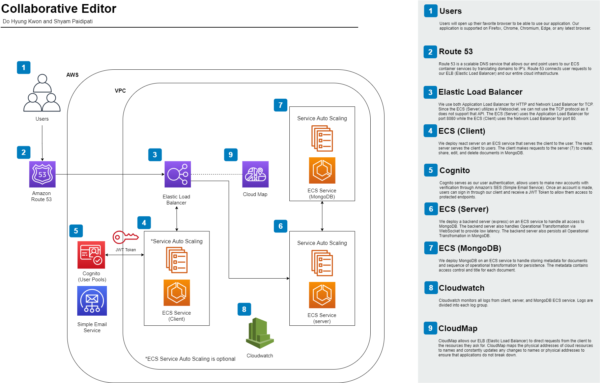

# Collaborative Editor
Final Project by Do Hyung (Dave) Kwon and Shyam Paidipati for ECE 465 Cloud Computing. 
## Project Goal and Purpose
The purpose of this project was to create a collaborative editor similar to websites and services like Overleaf and Google Docs. We aimed for two core functions for our project: any number of users could edit the same document at the same time and users could create, delete, share and edit documents with other users. An additional goal for the project was to add common text editing features found in popular editors like Overleaf and Google Docs such as text highlighting, text allignment, and the use of different font styles and sizes.     
## Dependencies
* React
* Quill
* Material-UI
* Express js
* ShareDB
* MongoDB

## Project Description
The system is divided into three primary components: client, server, and MongoDB. The project can be deployed locally or on AWS using docker-compose ECS and AWS Cloudformation. Since client, server, and MongoDB are deployed in ECS Service on AWS, these services can be automatically scaled with replicas depending on the load. It supports healthcheck on the system so that, if the service is malfunctioning, ECS Cluster will restart the service. At the bottom of the document, a full visualization of the cloud architecture deployed for our project is availible. 

### Front End
We use React for serving our front end client to users. The client mainly uses Material-UI for UI framework and Quill for WYSIWYG editor. Users will be able create, edit, share, and delete documents using the client.  
### Back End
We use Express js for creating backend server to handle all request for accessing data in MongoDB. For collaborative editing, we use ShareDB, a [Operational Transformation (OT)](https://en.wikipedia.org/wiki/Operational_transformation) framework. OT is the core behind how collaborative editing works. ShareDB communicates with the client using WebSocket for low latency. It also directly communicates with MongoDB for persistence.
### MongoDB
We use MongoDB to store both metadata and operational transformation from ShareDB for each document. Metadata includeds title and access control. 
## System Archtiecture on AWS

## Deployment
The system currently supports deploying locally with docker-compose or on AWS with docker-compose ECS. The specific problem specification we aimed to solve was having any number of users be able to use our application and collaborate simultaneously on shared documents. For this reason, we opted to deploy our client and server in an auto scaling ECS service to appropriately handle any traffic to our application.  

Refer to [BUILD.md](BUILD.md) for setting up environment and [INSTALL.md](INSTALL.md) for deploying locally or on AWS.
## Future Work
* Explore DocumentDB in AWS for replace MongoDB ECS Service. Currently we deploy mongoDB in an ECS service for the conviniece it provides testing locally. To improve our cloud deployment, migration to DocumentDB, AWS's document based database, will be necessary. This migration will make our cloud architecture more robust and scalable. 
* Improve on the current UI/UX. Currently, the UI is very sparce, providing a basic interface for all operation on our application. Further improvements could include autofill for emails of users to share documents with and a grouping mechanism to group documents for the user for better organization.  
## [Presentation Slides](https://docs.google.com/presentation/d/e/2PACX-1vQL80X3eEtKfeL-Q7mCkrRyv0-uwKQwc4Vrefkbz8oIpE1UZ_2HhfqFVb4G9YN4xBCa2G2iJuSuWPrq/pub?start=false&loop=false&delayms=3000)
## Presentation Video

## References
* [react-aws-cognito-example](https://github.com/patmood/react-aws-cognito-example)

